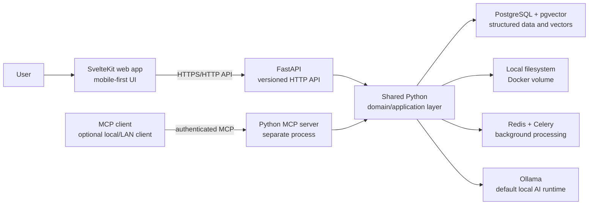
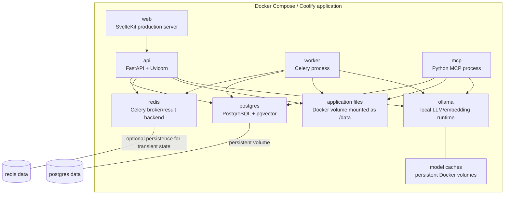
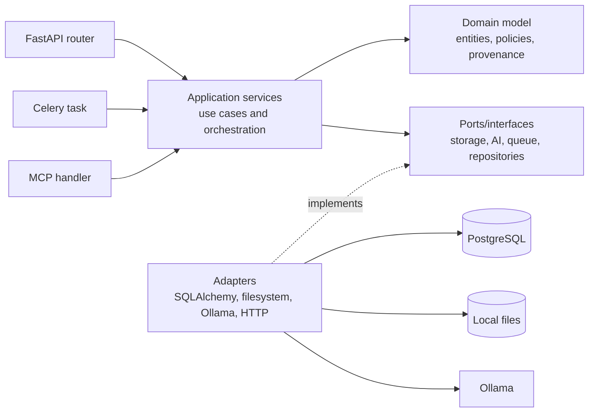
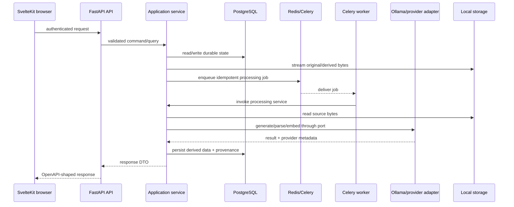

# ThoughtHarbor architecture

Status: accepted for the MVP

This document freezes the initial architecture for the self-hosted
ThoughtHarbor MVP. It describes the runtime topology, ownership boundaries,
communication paths, data rules, and deployment assumptions that subsequent
issues must preserve. Detailed decisions are recorded in the ADRs in this
directory.

## Goals and constraints

ThoughtHarbor is a mobile-first personal or organizational second brain for
meetings, documents, transcripts, emails, and structured knowledge. The MVP
must run without mandatory cloud services: original files, PostgreSQL, Redis,
AI inference, embeddings, and transcription remain inside the installation by
default.

The architecture optimizes for a small, maintainable team and a single
deployable product. It keeps clear seams for later worker scaling and provider
replacement without introducing operationally expensive service boundaries
before they are needed.

The MVP explicitly does not require a public SaaS control plane, mandatory
S3/object storage, a hosted vector database, a hosted queue, external
authentication, a dedicated graph database, or a separate AI microservice.

## System context

Users interact through the mobile-first web application. The HTTP API is the
stable application boundary for the web client and other authenticated
integrations. MCP-capable clients access the same application capabilities
through a separate, authenticated read-only MCP process.



External AI-compatible providers, when configured, are optional adapters
behind the shared AI interfaces. They are not part of the default context or
required for installation.

## Container and process topology

Docker Compose runs the following services. The API, worker, and MCP
containers use the same backend image or package so they cannot drift into
separate implementations of business logic.



PostgreSQL, Redis, Ollama, and the application file volume are internal by
default. Only the web/API reverse-proxy surface is published unless an
operator explicitly configures another transport. Coolify may manage the
Compose application and its public proxy, but it is not a required SaaS
dependency of the product.

### Runtime responsibilities

| Process or service | Responsibility | Must not do |
| --- | --- | --- |
| `web` | Render SvelteKit UI and call the typed API data-access layer | Own domain rules, duplicate DTOs, or hold server secrets |
| `api` | Authenticate requests, validate Pydantic input/output, translate HTTP, invoke application services, publish OpenAPI | Implement workflows inline in routers or expose SQLAlchemy models |
| `worker` | Execute queued, long-running, idempotent processing stages and report state | Become a second business-logic implementation inside task functions |
| `mcp` | Expose documented MCP tools and transport/authentication; invoke shared services | Access the database directly or bypass authorization |
| `postgres` | Own durable relational, provenance, and vector records | Become an implicit file store or accept transport-specific business rules |
| `redis` | Broker Celery work, hold task results/transient state, support bounded coordination | Become the source of truth for durable knowledge |
| `ollama` | Serve configured local chat, extraction, and embedding models | Be required when an explicitly configured provider is used |
| local storage | Own original and derived file bytes behind a storage abstraction | Expose arbitrary host paths or trust original filenames as paths |

## Modular-monolith boundary

The backend is a modular monolith: one Python package with explicit modules,
one domain model, and multiple runtime entrypoints. `api`, `workers`, and
`mcp` are process boundaries for HTTP isolation, asynchronous execution, and
protocol isolation—not separate business systems.



Application services are the only place where a complete use case is
assembled. Transport code maps input and errors. Infrastructure adapters
implement ports. This lets API requests, worker tasks, and MCP tools use the
same authorization, user scoping, idempotency, search, and provenance rules.

### Why there is no AI microservice in the MVP

AI calls have different latency and resource characteristics, but that is
handled by queueing long-running work and isolating worker processes. A
separate AI service would duplicate configuration, schemas, authorization
context, provenance handling, and error semantics while adding another
deployable dependency. The MVP therefore keeps provider protocols and adapters
inside the backend package. A separate service is justified only by a later,
concrete isolation requirement such as independent scheduling, hardware
ownership, or a hard security boundary; that decision must be recorded in a
new ADR.

## Communication paths



FastAPI requests must not wait for long transcription, parsing, embedding,
or AI extraction work. A request creates or reads durable processing state and
returns an observable status. Workers use explicit state transitions,
idempotency keys, bounded retries, and persisted processing attempts.

## Frontend contract

FastAPI/OpenAPI is the source of truth:

```text
Pydantic v2 schemas
        -> FastAPI routes and OpenAPI document
        -> reproducible TypeScript client generation
        -> SvelteKit data-access modules
        -> components and page load/actions
```

The API is versioned under `/api/v1`. Internal SQLAlchemy models never cross
the API boundary. API errors use stable machine-readable codes, and common
pagination, filtering, sorting, and request/correlation-ID conventions are
defined with the contract work in #6. Generated client code under
`apps/web` is an artifact and is never edited manually; CI detects drift.

SvelteKit owns presentation, navigation, optimistic UI only where safe, and
browser lifecycle concerns. The backend owns authentication, authorization,
validation, persistence, processing, search, AI orchestration, and provenance.

## Data ownership and lifecycle

PostgreSQL is the durable source of truth for users, sessions, source-file
metadata, normalized content, meetings, transcripts, processing state,
knowledge objects, relationships, chunks, embeddings, and derived artifacts.
pgvector stores embeddings associated with content chunks and explicit model,
dimension, and version metadata.

The local storage abstraction owns file bytes in logical areas such as
uploads, audio, documents, transcripts, and derived artifacts. Database rows
store generated internal identifiers, ownership, MIME/original-name metadata,
and stable storage references; callers never depend on physical paths.

Redis owns queue delivery, task result data, and bounded transient state. It is
not authoritative for knowledge or provenance. Ollama owns model execution and
persistent model caches, not application records.

Future multi-user support is anticipated through consistent ownership scopes
on durable records and application-service authorization, even if the first
installation creates one administrator.

## Provenance as a first-class requirement

Original source content is immutable from the perspective of AI processing.
AI-derived records are distinct records with provider/model/prompt metadata
and links to one or more supporting source records or chunks. Source evidence
retains its location metadata:

- document page, section, paragraph, or character offsets where available;
- transcript segment IDs, speaker labels, and start/end timestamps;
- email headers and body-part/location metadata where available;
- chunk boundaries and embedding model/version for retrieval results.

Parsing, chunking, extraction, search, RAG, API, UI, and MCP must propagate
these references. A generated citation is valid only when resolved from
stored provenance; a model-generated free-form citation is not authoritative.
Reprocessing creates a controlled new derived version or replacement linked to
the same source, preserving prior auditability and never silently overwriting
the original.

## Deployment assumptions

Docker Compose is the reference deployment for a workstation or private
server. It must provide persistent volumes for PostgreSQL, application files,
and model caches; readiness/health checks; CPU-first defaults; and optional
GPU configuration that does not change the domain or API contracts.

The same backend image is reused for API, worker, and MCP where practical.
Operators may place the web/API surface behind a reverse proxy with TLS.
Internal database, queue, and model services are not exposed publicly by
default. Coolify deployment uses the same Compose assumptions, environment
configuration, persistent volumes, and reverse-proxy boundary; it does not
replace local persistence with a hosted dependency.

## Scaling and evolution

The first deployment can run one API, one worker, and one MCP process. Worker
replicas can be added later because jobs are queued, idempotent, and backed by
durable state. API replicas can be added when session/auth and storage
configuration support it. PostgreSQL remains the source of truth; Redis is a
coordination layer.

New infrastructure or a new service boundary requires a concrete requirement,
an impact analysis, and an ADR. In particular, do not split AI, search, MCP,
or domain modules into services merely because they are named modules.

## Repository layout

```text
/apps
  /web                         SvelteKit + TypeScript frontend
/backend
  /src/thoughtharbor
    /api                       FastAPI routers and API schemas
    /auth                      authentication and authorization
    /domain                    entities, policies, and provenance rules
    /documents                 document use cases and parsing coordination
    /meetings                  meeting and transcript use cases
    /knowledge                 derived knowledge and relations
    /search                    lexical/semantic/hybrid retrieval
    /ai                        provider ports and adapters
    /transcription             FFmpeg/faster-whisper integration
    /diarization               local diarization port and adapters
    /mcp                       MCP server entrypoint and tool mappings
    /storage                   local storage port and adapter
    /tasks                     Celery task entrypoints
    /workers                   worker configuration and process entrypoint
  /tests                       backend tests
/docs
  /architecture                overview and ADRs
/docker                        Dockerfiles and deployment assets
/compose.yml                   self-hosted stack
```

The structure is a target established by #2 and is populated incrementally by
the issue dependency order. This architecture issue intentionally adds no
application runtime or framework bootstrap.

## ADR index

- [ADR-0001: Frontend/backend split and API contract](adr/0001-frontend-backend-split.md)
- [ADR-0002: Python modular monolith](adr/0002-python-modular-monolith.md)
- [ADR-0003: Celery and Redis for background processing](adr/0003-celery-redis-background-processing.md)
- [ADR-0004: PostgreSQL, pgvector, and local filesystem storage](adr/0004-postgresql-pgvector-local-storage.md)
- [ADR-0005: Provider-independent local AI runtime](adr/0005-provider-independent-ai-runtime.md)
- [ADR-0006: Separate Python MCP process](adr/0006-separate-python-mcp-process.md)
- [ADR-0007: Provenance-first knowledge model](adr/0007-provenance-first-knowledge-model.md)
