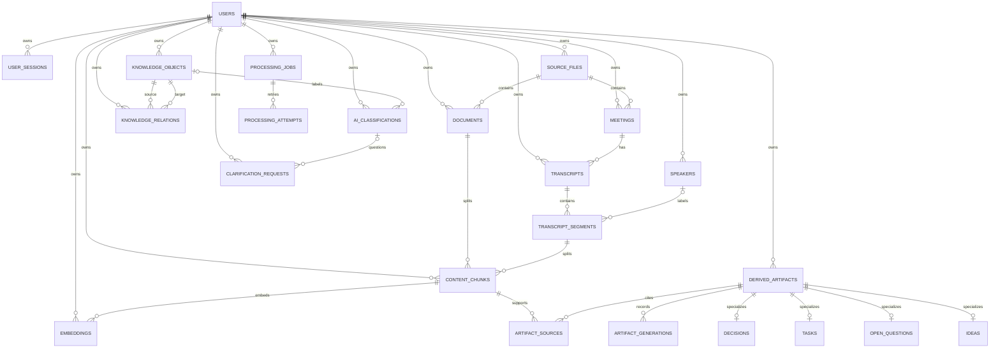

# Knowledge data model

Issue #8 establishes the first PostgreSQL persistence model for ThoughtHarbor.
The model is intentionally explicit: source content, derived content,
processing metadata, and graph relationships have separate tables so that
provenance and future multi-user scoping remain queryable.

## Entity relationships



## Ownership and lifecycle

User-owned records carry an `owner_id` foreign key and are indexed by owner.
Every model also has timezone-aware `created_at`, `updated_at`, and nullable
`deleted_at` fields. Deletion is therefore an explicit application-level
policy: normal reads must exclude rows with a non-null `deleted_at`, while
foreign-key `CASCADE`, `RESTRICT`, and `SET NULL` behavior protects dependent
data when a hard delete is deliberately requested.

`metadata` is JSONB for genuinely variable provider or ingestion details. It
is not used for fields that need relationships, constraints, ownership, or
search indexes.

## Provenance

Original content is represented by `source_files`, `documents`,
`transcripts`, and `transcript_segments`. `content_chunks` are addressable
source excerpts and preserve document character offsets, transcript
timestamps, and structured location metadata. AI-derived content is always a
`derived_artifacts` row with `content_origin = 'derived'`.

The queryable provenance chain is:

```text
source file -> document or meeting -> transcript segment -> content chunk
                                                           -> artifact source
                                                              -> derived artifact
```

`artifact_sources` is required for linking a derived artifact to supporting
chunks. `artifact_generations` records provider, model, model version, prompt
name/version, and optional confidence so a result can be audited or
regenerated. Specialized decision, task, open-question, and idea tables add
typed fields without confusing those records with original source content.

## Embeddings

Embeddings are separate from chunks so a chunk can be re-embedded by a new
provider or model without changing its source text. The MVP fixes the vector
dimension at 768, records provider/model/version and content hash, and adds a
pgvector HNSW cosine index. A future dimension change should be a deliberate
migration or a separate embedding table, never an implicit runtime change.

## Migrations and development fixtures

The baseline migration is
`backend/alembic/versions/afecd4d958df_create_initial_knowledge_model.py`.
It enables the local `vector` extension before creating the vector column and
indexes. Run it with:

```bash
uv run --directory backend alembic upgrade head
```

After the migration, the optional development fixture creates a small source,
chunk, derived summary, and provenance link:

```bash
uv run --directory backend python scripts/seed_dev.py
```

The fixture uses the configured `DATABASE_URL`; it is not used by production
startup and never logs document contents.
