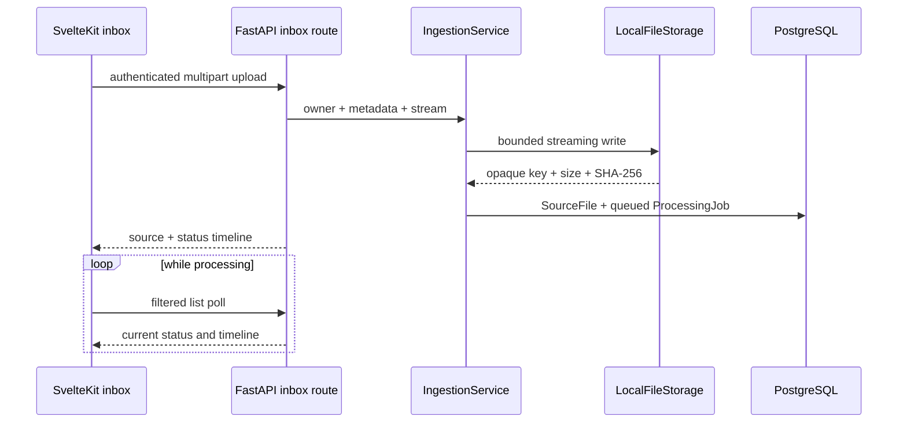

# Ingestion inbox

The authenticated `/api/v1/inbox` resource is the entry point for adding
knowledge without access to the host filesystem. It accepts multipart uploads
for documents, transcripts/text, email exports, and audio. Original bytes are
written through the local storage port and the database stores only the
generated storage key plus safe upload metadata.

## API flow

Uploads are owner-scoped by the authenticated session. `SourceFile` starts
with `uploaded` and `queued` timeline events; later processing issues advance
the same record through `parsing`, `transcribing`, `analysing`, `ready`,
`needs_input`, or `failed`. A failed source can be requeued with
`POST /api/v1/inbox/{id}/retry`, which appends a new `queued` event and creates
a new processing job while preserving history.

The current MVP API supports pagination and filters for `status` and
`source_type`. Detail responses include links to an existing `Document` or
`Meeting` row when a later processing stage has created one. Knowledge links
will be added by the corresponding extraction issues; the source record and
its provenance are not replaced by UI state.

## Frontend behavior

The mobile-first home route uses the native file picker and supports desktop
drag-and-drop. It reports XMLHttpRequest upload progress, displays actionable
API errors, polls active records every three seconds, and exposes a detail
drawer with the durable status timeline and failed-job retry action.
